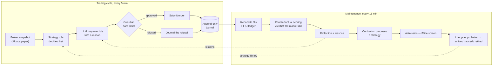

# Autopoiesis

**A self-evolving LLM trading agent that has to prove every strategy it keeps — against the
broker's own records — and retires the ones that cannot.**

[](https://github.com/liuyime2/autopoiesis/actions/workflows/ci.yml)
[](LICENSE)
[](pyproject.toml)
[](#safety)
[](tools/verify.py)
[](ruff.toml)
[](pyproject.toml)
[](https://alpaca.markets/)
[](https://ollama.com/)

*Autopoiesis* — from the Greek for "self-making": a system that produces and maintains itself.
This agent trades, scores its own decisions against what the market did next, proposes new
strategies, and removes the ones the evidence does not support. Every step is written to an
append-only journal, so whatever the agent claims about itself can be checked.

> **Paper trading only. Not investment advice. No performance claim.**
> Live trading is refused in code: any broker URL that is not Alpaca's paper endpoint is
> rejected before a client is built. On the record so far the system **does not** beat
> holding SPY — `make benchmark` prints the current verdict with its denominators.

## Contents

[What it is](#what-it-is) · [Features](#features) · [How it works](#how-it-works) ·
[Quick start](#quick-start) · [Paper trading](#paper-trading) · [Commands](#commands) ·
[Reproducing the results](#reproducing-the-results) · [Safety](#safety) ·
[Project layout](#project-layout) · [Documentation](#documentation) · [License](#license)

## What it is

Most LLM trading demos show a model choosing BUY or SELL. That is the easy part. The hard part
is knowing whether a decision was *any good*, and acting on the answer without fooling
yourself. Autopoiesis is built around that second part:

- **Evidence comes from the broker, not the agent.** PnL is computed from broker-confirmed
  fills, FIFO lot by lot. Nothing the model says about itself counts as evidence.
- **A strategy has to earn its place.** Strategies start on probation, are promoted only on
  measured evidence, and are paused or retired with the numbers written into the reason.
- **The model is scored against a baseline.** Each strategy's own rule decides first. The LLM
  may override it only by stating a reason, and both actions are recorded, so the model's
  contribution is measured as a pair on identical inputs.
- **Hard limits that the agent cannot change.** A deterministic Guardian sits on the only path
  that can submit an order, and it has no bypass.

## Features

| | |
|---|---|
| **Autonomous loop** | Every 5 minutes while the market is open: snapshot → decision → Guardian → order → journal. It starts at the open and drops to maintenance-only at the close. |
| **LLM decisions with a baseline** | A local LLM (via Ollama) sees the strategy's rule decision, the position and limits, and market context (regime, trend, volatility, returns). An override with no reason is discarded. |
| **Self-evolution** | Counterfactual scoring of every decision → calibration → reflection → a curriculum agent proposing new strategies → admission → offline screen → probation → promotion or retirement. |
| **Honest screening** | A strategy is compared with what its trading days alone would have scored, so a rising market does not pass as skill. It is rejected only when worse by two standard errors. |
| **Lessons with an ablation** | Each lesson in the prompt is shown on half the cycles. One with no measured effect after 10 trading days is retired. |
| **Constrained strategy DSL** | New strategies are parameter-only rules (`RULE`, `TREND_FOLLOW`, …) checked by a schema. The model never writes code. |
| **Bounded short selling** | SHORT/COVER sit behind `MIN_AGENT_SHORTS` (`off` / `shadow` / `paper`), with their own Guardian rule. Off by default. |
| **Broker-verified accounting** | FIFO lot ledger, realised and unrealised PnL, attribution to model vs baseline, and a SPY buy-and-hold benchmark on the same capital and window. |
| **Self-checking** | `make verify` runs 52 check classes over code *and* the running system; `make verify-self-test` breaks the gate on purpose to prove it can fail. A watchdog restarts the daemon, and a report is written after every close. |
| **Reproducible** | One script clones the committed tree into a new venv with no credentials and runs everything; its log is committed. |

## How it works



The journal (`runtime/autopoiesis/journal.jsonl`) is the only source of truth. Every other piece
of state is derived from it and can be regenerated. See
[`docs/ARCHITECTURE.md`](docs/ARCHITECTURE.md) for the execution path, the evolution loop and
which module owns which fact.

## What it has shown, and what it has not

Everything in this section is reproducible: each figure names the command that produces it. The
numbers move while the agent trades; run the command rather than trusting this page.

**Shown.** The accounting and the loop are real. Broker-confirmed fills, a FIFO lot ledger
attributed to the strategy that opened each lot, and a Guardian on the single order path — all
of it checked by 52 gate classes and reproducible on a clean clone with no credentials.

**Shown, and it is the one thing that survives every test.** Volatility is forecastable, and the
forecast is honest about when it stops working. On real bars the last month's volatility ranks the
next month's at rank correlation +0.31 to +0.57 per instrument, and an EWMA of daily returns beats
a long-run average by 47% out of sample. That is a statement about **risk, not direction**: it can
size a position, and it cannot tell you which way to go.

**Not shown: any directional edge.** 47 pre-stated price hypotheses and 14 news hypotheses went
through a family-wise gate; none carried a direction. The closest directional survivor (trailing
volatility against the next 21 days' return) dies once the market's common move is removed — it is
beta. The six-meridian indicator composite (MACD+KDJ+RSI+LWR+BBI+MTM) fires on **0.27%** of bars,
twice bullish in 33 years, and RSI and LWR disagree on 87% of them because `%R` is inverted, so
"six independent signals" is closer to four. It is recorded as UNDERPOWERED, not as a null it did
not earn.

**Not shown: that the agent beats holding.** `make benchmark` reports the agent's own return on
deployed capital after cost against SPY over the same window. Over the record on disk (19 trading
days against a 60-day target) the agent is **behind**, and the figure is printed with its
denominator. A per-strategy comparison is printed beside it as a *diagnostic* — given each strategy
its own peak capital, on its own window — and is labelled as such, because one weak strategy
failing is not the agent failing.

**Not shown: that the LLM helps.** A large share of decisions predate provenance capture and
cannot be attributed to a model at all; `make benchmark` prints that coverage with every share it
reports. Where paired comparison is possible, the model's most common override of the
deterministic rule is to refuse a trade the rule would have taken.

A read-only snapshot of the same numbers is generated as static HTML — `make status-page` writes
`runtime/autopoiesis/report/site/` with an overview, the decision trace (the rule's decision, the
model's override and its reason, the Guardian's refusal), the strategy lifecycle transitions with
their reasons, and an evidence page carrying the signal ledger's verdict counts. It has no order
path and reads no credentials; a value that cannot be computed reads UNKNOWN rather than zero.

### The VIX floor, stated as what it measured

The decision context carries a `risk` block whose volatility forecast can be raised — never
lowered — by the index's own implied volatility when the index is more worried than the symbol's
own history. It was fused because that relationship is one-sided on 4 of 4 instruments, and because
a floor can only shrink a position.

Measured against itself on the same bars, cost and window:

| | CAGR | Sharpe | max drawdown | floor engaged |
|---|---|---|---|---|
| SPY, no floor | 8.33 | 0.756 | −36.87 | 0% |
| SPY, VIX floor | 6.71 | 0.714 | **−26.52** | 43% |
| TLT, no floor | 2.93 | 0.314 | −39.85 | 0% |
| TLT, VIX floor | **3.49** | **0.394** | **−30.25** | 36% |

So it does what volatility targeting does: **it trades return for drawdown**, and on SPY that is
1.62 CAGR points for 10.4 points of maximum drawdown with a slightly *worse* Sharpe. It is a risk
measure and it is not an edge. `make research-vix-ab` reproduces the table.

## Quick start

No broker account, model or credentials are needed for any of this.

```bash
git clone https://github.com/liuyime2/autopoiesis.git && cd autopoiesis
python3 -m venv .venv && . .venv/bin/activate
make install                    # pip install -e ".[dev]"
make check                      # ruff + mypy + the test suite
make smoke-offline              # config and CLI end to end, no broker contacted
python examples/minimal_cycle.py  # the Guardian approving one order and refusing another
make verify                     # the full gate: 52 check classes
```

On Debian or Ubuntu, run `sudo apt install python3-venv` first. conda also works: the `make`
targets use an active venv first, then conda, and need neither.

## Paper trading

1. Create a free [Alpaca](https://alpaca.markets/) **paper** account and an API key.
2. Install [Ollama](https://ollama.com/) and pull a model (default: `qwen3.8:27b`; set
   `MIN_AGENT_MODEL` to use another). Without a model, the deterministic policy engine decides
   and every decision is labelled `fallback_policy_engine`.
3. Put the credentials in `${XDG_CONFIG_HOME:-$HOME/.config}/autopoiesis/env`, mode 600. They are
   never read from the repository. [`configs/paper.env.example`](configs/paper.env.example)
   lists every variable with its default:

   ```bash
   ALPACA_API_KEY=...
   ALPACA_SECRET_KEY=...
   ALPACA_BASE_URL=https://paper-api.alpaca.markets
   ```

4. Check the connection, then run it:

   ```bash
   make smoke                      # one real cycle against the paper account
   ./minictrl install-service      # systemd user units: daemon, Ollama, watchdog, research, report
   make run                        # start the daemon
   make status                     # alive? which strategy? last decision?
   make doctor                     # health of the running system, non-zero on any fault
   ```

On Linux, `loginctl enable-linger $USER` keeps the services running after you log out and
starts them at boot. The daemon trades by itself at the open and drops to maintenance at the
close. The report timer writes `runtime/autopoiesis/reports/<date>.txt` at 16:30 New York time
on weekdays.

## Commands

Every task is a `make` target.

| Command | What it does | Needs a broker |
|---|---|---|
| `make check` | lint + mypy + tests | no |
| `make smoke-offline` | config and CLI end to end with `--skip-broker` | no |
| `make verify` | the gate: 52 check classes; `CLASS=<name>` re-runs one | no¹ |
| `make verify-self-test` | breaks the gate on purpose and checks it fails | no |
| `make smoke` | one real cycle against the paper account | yes |
| `make fast` | check + smoke + the gate | yes |
| `make run` / `stop` / `restart` / `status` | control the daemon via systemd | yes |
| `make doctor` | health of the running system | yes |
| `make benchmark` | each strategy against SPY buy-and-hold, same capital and window; exit 0 ahead / 1 behind / 2 nothing to measure | journal |
| `make daily-report` | one trading day's validation report (`DATE=YYYY-MM-DD`) | journal |
| `make status-page` | a read-only static snapshot: overview, decisions, strategies, evidence | journal |
| `make pipeline` | validate-data → test → evaluate → reproduce | journal |
| `make reproduce` | record commit, config, versions and metrics for a run | no |

¹ On a deployment the gate also checks the running daemon. On a fresh clone, those checks
report SKIP rather than FAIL.

When the gate is red, read which class failed before concluding the code is wrong. Some
classes judge the running system (for example, "is the model adding value?"). Those can fail
on a trading result, while `make check` speaks only about the repository.

## Reproducing the results

```bash
docs/evidence/run-fresh-clone.sh
```

This clones the committed tree into a scratch directory, creates a new venv, removes every
credential, and runs seven steps: lint, the full test suite, the example, the entry point,
provenance, the gate's self-test and the gate. The output is committed as
[`docs/evidence/fresh-clone.log`](docs/evidence/fresh-clone.log), and the gate checks that log
against the script and the commit it names. CI runs the same steps on every push.

Figures about trading, by contrast, come from a running paper account and change as it
trades, so they are not written into these documents. Reproduce them on your own record with
`make benchmark`, `make doctor` and `make daily-report`. The strategy search's full trial
ledger — 59 walk-forward trials on real bars, none of which passed — is in
[`docs/evidence/`](docs/evidence/README.md).

## Safety

Read once from the environment by `config.py` and enforced by `guardian.py` on the single path
that can submit an order:

| Limit | Env var | Default |
|---|---|---|
| max position value | `MIN_AGENT_MAX_POSITION_VALUE` | $5,000 |
| max total exposure | `MIN_AGENT_MAX_TOTAL_EXPOSURE` | 4× position value |
| max daily loss | `MIN_AGENT_MAX_DAILY_LOSS` | $500 |
| max trades per day | `MIN_AGENT_MAX_TRADES_PER_DAY` | 10 |
| min confidence | `MIN_AGENT_MIN_CONFIDENCE` | 0.5 |
| short selling | `MIN_AGENT_SHORTS` | `off` |
| manage the whole account | `MIN_AGENT_MANAGE_ACCOUNT` | `false` |
| universe | `MIN_AGENT_UNIVERSE` | `allowlist`; `account` adds every held symbol; `tradable` adds any active US stock on a major exchange priced at least `MIN_AGENT_MIN_PRICE` ($5) |
| extra symbols looked at per round | `MIN_AGENT_ATTENTION_SLOTS` | 0 (the broker's most-active liquid names, filtered) |

- **Paper only.** `config.is_paper_endpoint` is the single definition, and both the CLI and the
  executor go through it.
- **The universe is the account holder's decision.** By default only the allowlist can be
  traded. `MIN_AGENT_UNIVERSE=account` adds everything the account holds, and `tradable` adds
  any active US stock on a major exchange priced at least $5 (never a warrant, unit or right).
  Widening changes which symbols pass and nothing else: paper only, market open, a fresh
  snapshot, the position and exposure caps (the exposure cap then measures the whole account),
  daily loss, trades per day and confidence all still apply.
- **By default the agent only sells what it bought.** A SELL is bounded by the agent's own
  confirmed fills, not by what the account holds. An account holder who wants the agent to
  manage every position sets `MIN_AGENT_MANAGE_ACCOUNT=true`, and a SELL is then bounded by the
  account's position. Every other limit still applies. A SHORT is refused while the account holds any long
  in that symbol, and a COVER may only buy back what the agent itself shorted.
- **Limits only get tighter.** Nothing in the code raises a limit. A higher limit is the
  operator's decision, made in the env file.
- **No generated code runs.** The model returns structured decisions and strategy parameters
  checked against a schema, and never shell commands or code.
- **Market-open and staleness checks** cannot be skipped. A stale snapshot is refused.

Report a vulnerability as described in [`SECURITY.md`](SECURITY.md).

## Project layout

```
src/autopoiesis/          the package (import name autopoiesis). 43 modules, 3 external dependencies.
  cli.py                the single entry point
  daemon.py             the trading loop and the maintenance loop
  loop.py               one cycle: snapshot -> decision -> guardian -> execute
  guardian.py           hard risk limits; no bypass
  llm_decision.py       rule-first decisions, the LLM override, market context
  strategy_engine.py    strategy library, selection, lifecycle
  evaluator.py          FIFO ledger and PnL from broker-confirmed fills
  counterfactual.py     scoring each decision against what the market did next
  curriculum.py         the agent proposing new strategies
  journal.py            append-only record; the source of truth
  models.py             shared schema, imported by 23 modules
  research/             walk-forward backtests; production may not import it
tools/                  the gate (verify.py), benchmark, daily report, probes, systemd templates
tests/autopoiesis/        78 test files
examples/               the smallest runnable example, no broker needed
configs/                paper.env.example: every environment variable with its default
docs/                   ARCHITECTURE.md, evidence/, history/
minictrl                operator script: services, logs, owner history
```

## Documentation

- [`docs/ARCHITECTURE.md`](docs/ARCHITECTURE.md): how the system is put together.
- [`tools/README.md`](tools/README.md): every tool and what it checks.
- [`CONTRIBUTING.md`](CONTRIBUTING.md): how to propose a change, and the rules a change must keep.
- [`AGENTS.md`](AGENTS.md): the working principles every change follows, human or AI.
- [`CHANGELOG.md`](CHANGELOG.md): what changed.
- [`docs/history/`](docs/history/README.md): the running log, the defect audit and one plan per
  change. It records why decisions were made, including claims that were later retracted.
- [`docs/history/plans/2026-10-09-remaining-work.md`](docs/history/plans/2026-10-09-remaining-work.md):
  the roadmap - what is done with the command that proves it, what is measured and deliberately not
  fused, and what is open. It is a short index rather than a running log: the log lives above.

## License

[Apache License 2.0](LICENSE). This software makes no claim of profit, and nothing in it is
investment advice. The figures it reports are evidence that the accounting and the loop are
real, not a track record.
